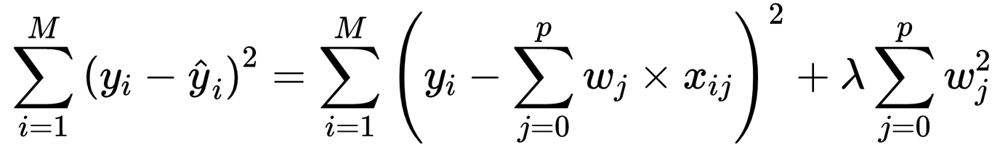
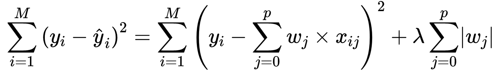

# Forecasting Federal Rate with Machine Learning using Lasso Regression Model
**Predicted Federal Rate of 1.5% at April 26th with Lasso Regression**

```python
from sklearn.preprocessing import MinMaxScaler, RobustScaler, StandardScaler
from sklearn.linear_model import LinearRegression, ElasticNet, ElasticNetCV

scaler = StandardScaler()
model = Lasso(alpha=0.3, normalize=False) # or LinearRegression, Ridge, ElasticNet

df = pd.read_csv("data_1970-2022.csv") # made with get_fred_data()

for column in df.columns:
    column_name = f"{column}_rolling_1m"
    df[column_name] = df[column].rolling(window=30).mean()

df_monthly = df.resample('M').min()
X = df_monthly.drop(['INTDSRUSM193N'], axis=1) # set INTDSRUSM193N as target
y = df_monthly['INTDSRUSM193N']

X = scaler.fit_transform(X) # scale data
y = scaler.fit_transform(y.values.reshape(-1,1))

model.fit(X, y) # train model

prediction = model.predict(X[-1:]) # predict next 3 steps with the model
prediction = scaler.inverse_transform(prediction)
print(prediction)
```

To further explain the code, StandardScaler has been adapted to scale different kinds of data. Moving average has been added to represent the months’ index. Minimum value of index / price level has been adapted along with it to represent the possibility of the shock. `INTDSRUSM193N` is set to be target for the prediction, thus is dropped from the train dataset and was moved to the test/validation dataset. The data was then passed through the pre-defined scaler and trained with the Lasso regression model. Prediction was yielded with model’s predict method and inverse transformation of the normalized result prediction.

**Numbers of data points were limited to perform classification task in which left room for regression models to outperform.**  Dataset was consisted of 9 selected key derivatives price, such as commodities-based or market indices-based, and macroeconomic indicators from 1970 to 2022. However, Total data is 350 sequence length of timeseries data. **Moreover, 10% worth of such data represents rising interest rate.** Regression problem seemed to be more appropriate since there are more features available compared to the length fo the dataset.

**Given regression models from the scikit-learn package(Linear, Ridge, Lasso and ElasticNet) were compared where Lasso showed greatest performance.** Model’s performance and selection will further be mentioned in the conclusion. Metrics of the model were R2 score and RMSE score to evaluate the performance, where its code were written as the following.

Specifically, linear regression model is finding the least Sum of Squared Errors(SSE). Additional predictor variables to the model may decrease the error, but there is possibility of the overfit which reduces the generalization performance for the test data. Ridge and Lasso is introduced to find the balance between the model’s performance and the numbers of predictor variables. First equation below is the Ridge’s cost function where sum of the squared coefficients were added to the cost function of SSE. 



On the other hand, the second equation below is the Lasso’s cost function where absolute value of coefficients were added instead. This enables predictor variables to disappear with zero coefficient which leads to selecting more important independent variable.



ElasticNet’s cost function written below is the weighted mean of Lasso and Ridge’s regularization to the Sum of Squared Errors. Thus the model can be summarized as finding fit for the linear regression model with squared(L2) and absolute value(L1) penalization term. 


